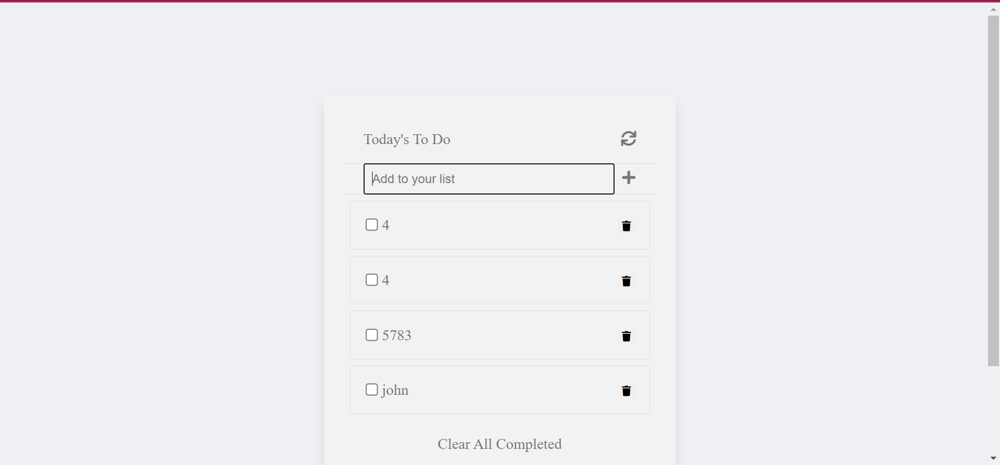

# TODO-list

This is a todo list where you can add and remove items.

## Built With

- Javascript
- HTML
- CSS

## How to use and run this project

>To get a local copy up and running follow these simple example steps.

- Clone this repository with

git clone https://github.com/zairdon20/Todo.git using your terminal or command line.

-Change to the project directory by entering :

cd Todo in the terminal.z  

- run code . to open it in vscode

- Install packages using the command npm install

- run the project locally by entering the command npm start 

## Project status

This project has been deployed

## Screenshots

### Deployment

This project is deployed on a github page on the link below:

- https://zairdon20.github.io/Todo/

## Issues
Up to now, there are no issues with it.

Here is the link to the issues tab:

https://github.com/zairdon20/Todo/issues

## Author

👤 **Josphat Nkonde**

- GitHub: [@zairdon20](https://github.com/zairdon20)
- Twitter: [@Josphat1](https://twitter.com/Josphat1/)
- LinkedIn: [zairdon](https://www.linkedin.com/in/zairdon/)

## Show your support

Give a :star:️ if you like this project!

## Acknowledgments

Thanks to everyone who helped me.

## 📝 License

This project is [MIT](./MIT.md) licensed.
